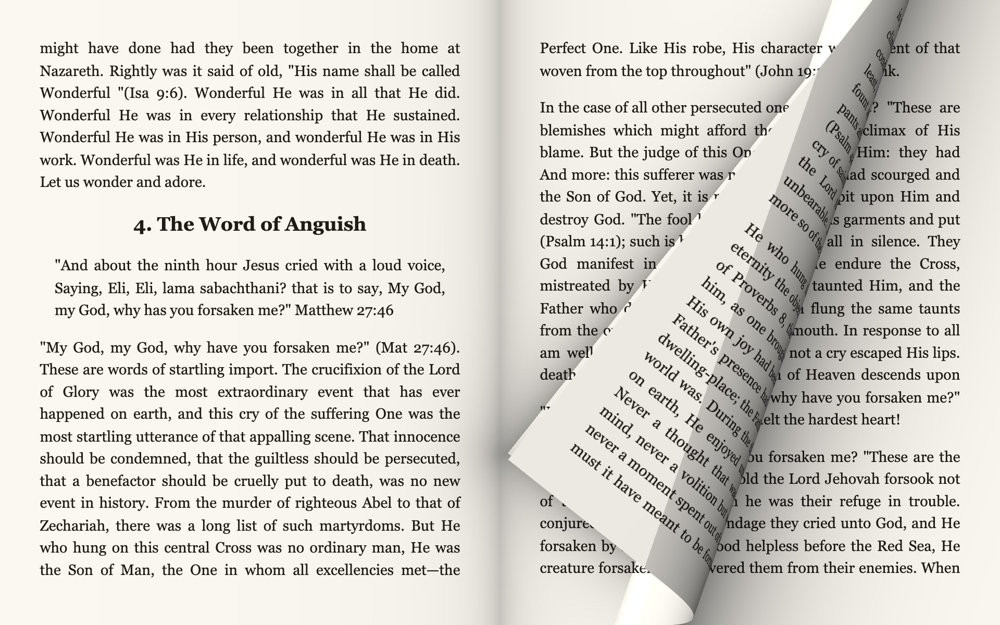
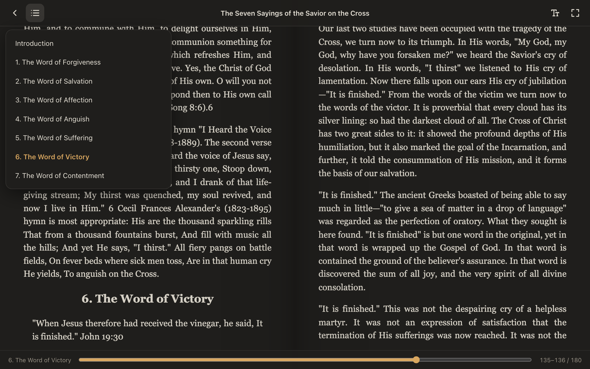

# Lector EPUB

Lector de EPUB de escritorio con **paso de página realista**. La hoja se toma con el dedo, el lápiz o el mouse, se curva en 3D siguiendo el gesto y se asienta con física de resorte. Está pensado para **Windows on ARM (Surface)**, con un binario nativo `aarch64` sobre WebView2, y también corre en macOS.



<table>
  <tr>
    <td width="42%"></td>
    <td></td>
  </tr>
</table>

## Características

- **Curl 3D en WebGL2.** La página se envuelve sobre un cilindro, con iluminación, reverso visible, sombra proyectada y sombra del lomo. Se puede agarrar desde cualquier esquina o borde, y al soltar decide si completa o vuelve según la posición y la velocidad (flick).
- **Libro abierto o una página.** En horizontal muestra dos páginas con lomo al centro; en vertical o en ventanas angostas, una sola.
- **Hojeo al saltar de capítulo.** Al elegir un capítulo del índice pasan varias páginas reales hasta llegar.
- **Vuelve donde quedaste.** La posición se guarda como un ancla de texto, así que sobrevive a cambios de fuente, tamaño de ventana y rotación.
- **Biblioteca** con portadas y progreso. Los libros se abren desde un diálogo o arrastrándolos a la ventana; con el instalador, también con doble clic en el `.epub`.
- **Ajustes de lectura:** tamaño, tipografía, interlineado, márgenes, temas papel, sepia y noche, y modo de página.
- **Entrada completa:** táctil, lápiz, mouse, rueda y teclado (`←` `→` `PgUp` `PgDn` `Espacio` `F11`).
- **EPUB 2 y EPUB 3:** OPF, spine, NCX o nav, portada, CSS e imágenes del libro.

## Probarlo en una Surface

El instalador y el portable salen de la compilación ARM64 (ver más abajo). Para ejecutarlos:

| Archivo | Uso |
| --- | --- |
| `Lector EPUB_<versión>_arm64-setup.exe` | Instalador por usuario, sin admin. Asocia los `.epub` e instala WebView2 si falta. |
| `epub-reader.exe` | Portable. Requiere WebView2, que Windows 11 ya trae. |

> La app no está firmada: SmartScreen mostrará un aviso. Se pasa con **Más información → Ejecutar de todas formas**.

## Desarrollo

Requisitos: Node 22+ y Rust (solo para la app nativa).

```bash
npm install
npm run dev          # lector en http://localhost:1420
npm test             # tests del parser EPUB
npm run tauri dev    # app nativa (macOS / Windows)
```

`http://localhost:1420/curl-lab.html` es un laboratorio aislado del curl, con páginas sintéticas y HUD de fps. Con `?debug`, la función `pose(x, y)` en la consola congela una pose del curl.

## Compilar para Windows ARM64

**Desde macOS** (cross-compile con [cargo-xwin](https://github.com/rust-cross/cargo-xwin)):

```bash
brew install llvm lld nsis
cargo install --locked cargo-xwin
rustup target add aarch64-pc-windows-msvc
export PATH="/opt/homebrew/opt/llvm/bin:/opt/homebrew/opt/lld/bin:$PATH"
npx tauri build --runner cargo-xwin --target aarch64-pc-windows-msvc
```

cargo-xwin descarga el CRT y el SDK de Windows de Microsoft, lo que implica aceptar su licencia. El resultado queda en `src-tauri/target/aarch64-pc-windows-msvc/release/`: el portable `epub-reader.exe` y el instalador en `bundle/nsis/`.

**En GitHub Actions**: el workflow [`windows-arm64.yml`](.github/workflows/windows-arm64.yml) compila en el runner nativo `windows-11-arm`. Se lanza a mano (*Run workflow*) o al publicar un tag `v*`, y deja ambos ejecutables como artefacto.

## Cómo funciona

```
EPUB (zip) ──► parser (fflate + DOMParser) ──► un iframe por capítulo, paginado con CSS multi-column
                                                    │
                           en reposo: DOM real      │   al empezar un gesto:
                           (texto nítido)           ▼   páginas → SVG foreignObject → canvas → textura GPU
                                                        │
                                   PageTurner (gestos + resorte) ──► CurlRenderer (WebGL2, malla 64×80)
```

- **Paginación.** Cada capítulo vive en un iframe aislado (sin scripts) con CSS multi-column. Una página equivale a una columna y cambiar de página es un `translate3d`.
- **Texturas.** Las páginas se rasterizan en grupos a través de un SVG `<foreignObject>`, a la resolución real de la pantalla, y se suben a la GPU una vez. Esto ocurre solo con el lector en reposo, nunca durante un giro. Las páginas vecinas se precargan.
- **Curl.** La geometría es estática: por frame solo cambian unos pocos uniforms (eje del doblez, dirección y radio), así que el costo de CPU es prácticamente nulo. El eje sale de la bisectriz entre la esquina tomada y el dedo, corregida por el radio: `d = (L + πR) / 2`. La esquina queda sujeta al lomo, así que la hoja no se puede "arrancar".
- **Fluidez.** Usa Pointer Events con `getCoalescedEvents` y `getPredictedEvents`. Dibuja solo dentro de `requestAnimationFrame` y solo mientras hay animación. El resorte está críticamente amortiguado y hereda la velocidad del dedo al soltar.
- **Windows ARM64.** El binario es nativo `aarch64-pc-windows-msvc` (nunca x64 emulado). WebGL corre con `powerPreference: high-performance`, sin MSAA cuando la densidad de píxeles es 2× o más (en Adreno sale caro) y con `desynchronized: true` para bajar la latencia del lápiz.

## Estructura

| Ruta | Contenido |
| --- | --- |
| `src/epub/book.ts` | Parser EPUB 2/3: metadatos, spine, índice, portada |
| `src/epub/resources.ts` | Recursos del zip como URLs `blob:` o `data:`, con reescritura de CSS |
| `src/reader/section.ts` | Capítulo en iframe, paginación, anclas y rasterizado a SVG |
| `src/reader/pageCache.ts` | Caché LRU de texturas en GPU |
| `src/reader/curl/` | Shaders, física del curl, gestos (`PageTurner`) y renderer WebGL2 |
| `src/reader/Reader.ts` | Orquestación: navegación, prefetch, hojeo y persistencia |
| `src/main.ts`, `src/ui/` | Biblioteca, barras, índice y ajustes |
| `src/storage.ts` | Biblioteca (IndexedDB) y posición y ajustes (localStorage) |
| `src-tauri/` | Shell nativo: ventana, apertura por asociación `.epub` y bundle NSIS |

## Limitaciones conocidas

- Todavía no se puede seleccionar texto: la capa de gestos cubre la página.
- Las fuentes web embebidas en el EPUB pueden verse con la fuente de respaldo durante el giro.
